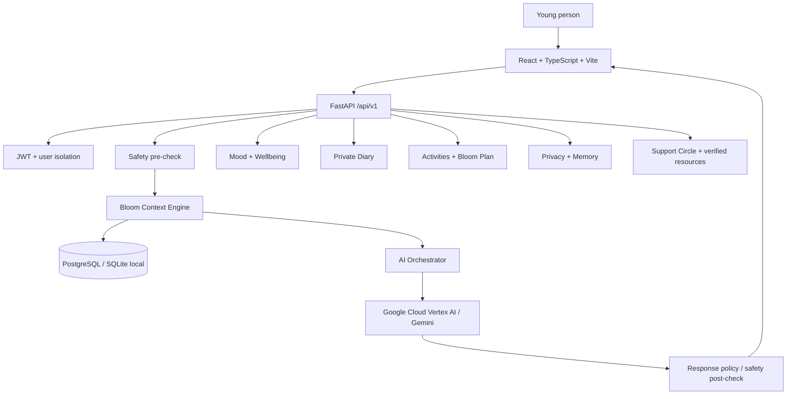

# MindBloomAI Architecture

The critical Bloom path is: Authentication → input validation → safety pre-check → user-approved context retrieval → prompt construction → Gemini → output policy gate → response.

No raw API key is embedded in the frontend or backend source.
